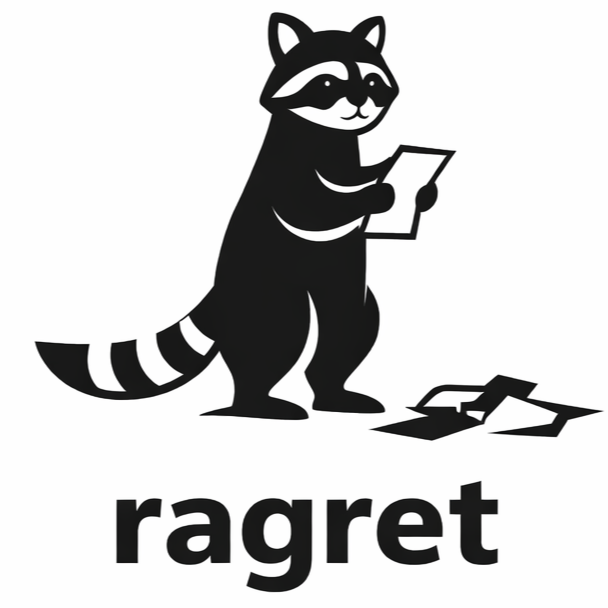

<p align="center">
  
</p>

## Overview
**ragret** is a stable, lightweight evaluation framework for Retrieval-Augmented Generation (RAG) systems that doesn’t change often.
Its goal is simplicity: small, modular metrics that are easy to understand, extend, and integrate into existing pipelines. It was created out of the frustration with other frameworks constantly changing, making code from one version to the next useless. With **ragret**, the focus is clear: simple, implement-as-you-go metrics that you can rely on without having to rewrite your established code.

## Metrics
**ragret** provides evaluation metrics for assessing different aspects of RAG system performance, including:
- Faithfulness
- Context Recall
- Context Precision
- Response Relevancy
- Product Relevancy (for systems related to product recommendation)

## Installation
Use pip to install the package
```bash
pip install ragret
```
Or clone the repository:
```bash
git clone https://github.com/christopherkormpos/ragret.git
cd ragret
```
You will need to set you enviromental variable "test_api_key" to your OpenAI API key.
## Usage
All metrics are exposed on upper level. Therefore they can be imported as susch:
```python
from ragret import Faithfulness, ContextRecall, ContextPrecision, ResponseRelevancy, ProductRelevancy
```
------------------ this is where each metric will go and its explantaion along with its formula -------------
## Example
```python
from ragret import Faithfulness

metric = Faithfulness()

result = metric.score(
    user_query="How can I contact Marmero?",
    llm_answer="You can contact us via email at marmerostudio@gmail.com.",
    contexts="FAQ: You can contact us via email..."
)
print(result)
```
Expected output
```python
{
    "score": 1.0,
    "claims": [...],
    "supported_claims": [...],
    "unsupported_claims": [...]
}
```
--

## Contact
If you encounter any issues or bugs with the application, or if you face difficulties while building the project locally, feel free to reach out to me:

- **Email**: christopher.kormpos@gmail.com
- **GitHub**: https://github.com/christopherkormpos
- **LinkedIn**: [LinkedIn Profile](https://www.linkedin.com/in/christopher-kormpos-27808b194/)

## License
This project is licensed under the MIT License - see the [LICENSE](LICENSE) file for details.