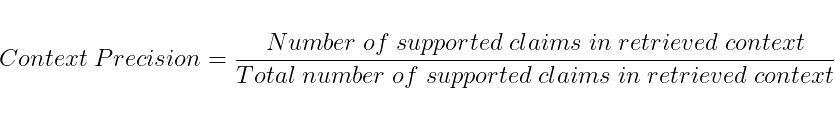
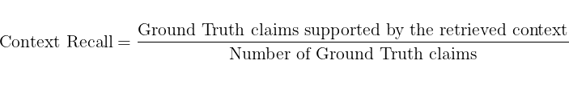
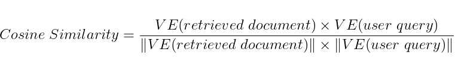
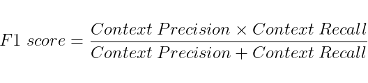
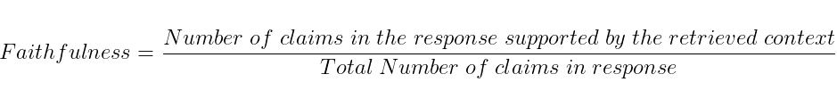
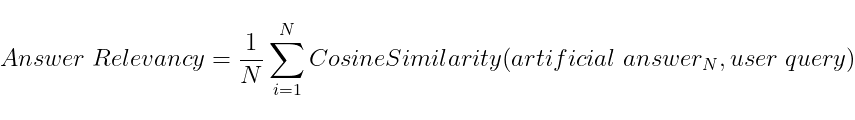
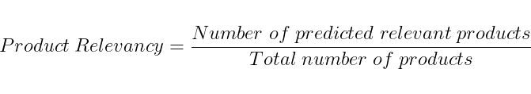

<h2 align="center">
  METRICS DOCUMENTATION
</h2>

## Overview
Metrics are categorized into `Retrieval metrics` and `Generation metrics`, which constitute the original evaluation metrics. In addition, there are `Custom metrics` that allow users to define their own measures, making the evaluation process more flexible and tailored to specific needs. Furthermore, metrics are distinguished as  and , depending on whether they leverage large language models. All metrics are presented below along with their corresponding tags for clarity and reference.

## Retrieval Metrics
### Context Precision 
  
*Does the retrieved context provide relevant information to support the answer?* 
Requires: `User Query` and `Retrieved Documents` 

Context Precision measures how much of the retrieved context is actually useful for answering the user query. 
It ranges from 0 to 1, where higher scores indicate that the retrieved context is highly relevant to the query. 

To calculate context precision:
1. Extract factual claims from the retrieved context using an LLM or other method.
2. Compare each claim against the user query to see if it is relevant for answering the query.
3. Compute Context Precision using the formula:

### Context Recall
  
*Does the retrieved context contain the information needed to produce the ground-truth answer?* 
Requires: `Retrieved Documents` and `Ground Truth` 

Context Recall measures how much of the ground-truth (reference) answer is actually backed by the retrieved context. 
It focuses on not missing important results. 
Higher recall means fewer pieces of the ground truth were left unretrieved.
In short, recall is about not missing anything important.
To calculate this: 
1. Extract claims from the ground-truth answer
2. Check whether each ground-truth claim is supported by the retrieved context
3. Compute recall using the formula:

### Cosine Similarity
  
*Does the retrieved context semantically align with the user query?* 
Requires: `User Query` and `Retrieved Documents` 

Cosine similarity measures the semantic similarity between the user input and each of the retrieved documents. 
It returns a list of numbers between 0 and 1 that represent the cosine similarity for all the documents in the retrieved context.  
It is computed using the formula:

### F1Score
  
*Does the answer cover the important information in the retrieved context accurately and completely?* 
Requires: `Context Precision` and `Context Recall` 

F1 score represents a harmonic mean of precision and recall, balancing both. 
It ranges from 0 to 1, where higher scores indicate better overall performance of the system. 
Compute f1-score using the formula:

## Generation Metrics
### Faithfulness
  
*Are the claims in the answer supported by the retrieved context?* 
Requires: `Retrieved Documents` and `LLM Answer` 

The Faithfulness metric measures how factually consistent a response is with the retrieved context.  
It ranges from 0 to 1, with higher scores indicating better consistency. 
A response is considered faithful if all its claims can be supported by the retrieved context. 
To calculate this: 
1. Identify all the claims in the response. 
2. Check each claim to see if it can be inferred from the retrieved context.
3. Compute the faithfulness score using the formula:

### Answer Relevancy
  
*If we inferred questions from the answer, would they match the user’s question?* 
Requires: `User Query` and `LLM Answer` 

The Anser Relevancy metric measures how relevant a response is to the user input 
It ranges from 0 to 1 with higher scores indicating better alignment with the user input 
To calculate this
1. Generate a set of artificial questions (default is 3) based on the response
>These questions are designed to reflect the content of the response
2. Compute the cosine similarity between the embedding of the user input and the embedding of each generated question
3. Take the average of these cosine similarity scores to get the Answer Relevancy
You can calculate the Answer Relevancy using the formula:

## Custom Metrics
### Product Relevancy
  
*Do the products retrieved from the database match the user's request?*  
Requires: `User Query` and `Products Retrieved` 

Product Relevancy measures how many relevant products were retrieved 
>OPTIONAL: Use real human labels to decide product relevancy based on the search the user made
To calculate this: 
1. Extract relevant products from the products retrieved
2. OPTIONAL: With LLM check whether each product is relevant to the user quer
3. Compute metric using the formula:

 

### Token Counter
  
*How many tokens does your RAG system consume per query?*  
Requires: `User Query`, `Retrieved Documents` and `LLM Answer` **+** the `PROMPT` of your RAG system 

Token Counter is not a quality score but a cost and efficiency report. Unlike the other metrics it does not run through the `Evaluator` and does not return a value between 0 and 1. Instead it takes the whole dataset, reconstructs the input exactly as your RAG system would build it (the `PROMPT` filled with the retrieved context and the user query) and counts the tokens of both the input and the `LLM Answer`. Counting is done with the provider's own tokenizer (`tiktoken` for **OpenAI**, `count_tokens` endpoint for **Google**, and a prompt-evaluation call for **Ollama**), so no answer is ever generated and no extra cost is incurred. 

It computes input, output and total tokens for every record in your dataset. Once every record is processed it returns the dataset-wide averages: `avg_input_tokens`, `avg_output_tokens` and `avg_total_tokens`. 
To calculate this:
1. Reconstruct the input for each record from the `prompt_template`, retrieved context and user query
2. Count the input tokens and the output (`LLM Answer`) tokens with the provider's tokenizer
3. Average the input, output and total token counts across the whole dataset

> Token Counter reports raw token counts only. To estimate cost, multiply the averages by your model's per-token pricing (e.g. `avg_input_tokens * input_price + avg_output_tokens * output_price`).
 

*For guidance on using all these metrics, please refer to the [README](https://github.com/christopherkormpos/ragret/blob/main/README.md) file.*